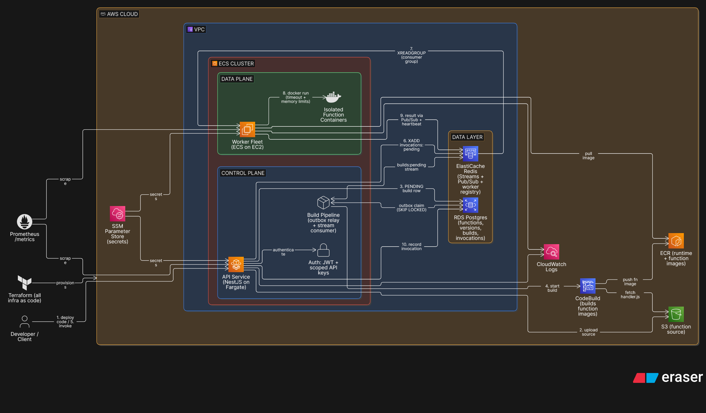
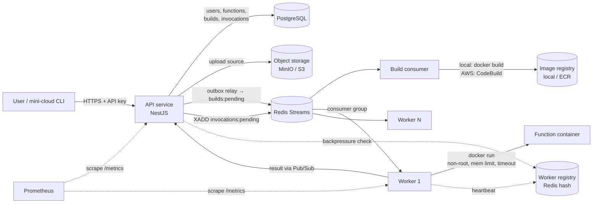

# Mini Serverless Cloud Platform

A serverless (Function-as-a-Service) platform built from scratch in
TypeScript. It is *inspired by* AWS Lambda but not a clone of it. You
upload a function, the platform builds it into a container image, stores
it, and gives you an HTTP endpoint. Every call runs in its own isolated
Docker container on a pool of workers.

I built it in 13 phases, starting with a function executor running in a
single process and ending with a Terraform-provisioned AWS deployment. The
goal was to learn how cloud platforms work under the hood: containers and
isolation, queues, scheduling, multi-tenancy, observability, Kubernetes,
and infrastructure-as-code. Each phase was verified against real
infrastructure, not mocks. The bugs listed below were found by running the
system, not by reading the code.

```bash
npm install -g @praveen-adii/mini-cloud-cli     # the CLI is published on npm
mini-cloud deploy ./handler.js --name hello
mini-cloud invoke hello --data '{"name":"world"}'
```

---

## Contents

- [Architecture](#architecture)
- [Tech stack](#tech-stack)
- [Try it yourself](#try-it-yourself)
- [The CLI](#the-cli)
- [REST API reference](#rest-api-reference)
- [How it was built, phase by phase](#how-it-was-built-phase-by-phase)
- [Measured results](#measured-results)
- [Bugs found by running it for real](#bugs-found-by-running-it-for-real)
- [AWS mapping](#aws-mapping)
- [Repository layout](#repository-layout)
- [Known limitations and what's next](#known-limitations-and-whats-next)

---

## Architecture





**Deploy path:** `POST /functions/:name/versions` uploads the source to
object storage and writes a `PENDING` Build row. That write goes to
Postgres only. A **transactional-outbox relay** then publishes the build
to a Redis Stream, and a build consumer turns it into an image (local
`docker build`, or AWS CodeBuild pushing to ECR). The client polls
`GET /functions/:name/builds/:id` until the build finishes.

**Invoke path:** `POST /functions/:name/invoke` checks for spare worker
capacity (backpressure) and then adds a self-contained job to
`invocations:pending`. One worker in the consumer group picks it up and
runs the image in a fresh container with limits enforced by the host.
The worker publishes the result on a per-request Pub/Sub channel, and
the waiting API request returns it. The API also records every
invocation in Postgres.

---

## Tech stack

| Area | Technology |
|---|---|
| Language / framework | TypeScript, Node.js 20, NestJS 10 |
| Database / ORM | PostgreSQL 16, Prisma 5 |
| Queue / coordination | Redis 7: Streams (consumer groups), Pub/Sub, hashes |
| Object storage | MinIO locally, AWS S3 in the cloud (same `@aws-sdk/client-s3` code) |
| Isolation | Docker containers: non-root user, memory limits, host-enforced `docker kill` on timeout |
| Auth | bcrypt passwords, JWT sessions, hashed, scoped API keys |
| Observability | prom-client + Prometheus, structured JSON logs, invocation history with p50/p95/p99 |
| Load testing | k6 |
| Orchestration | Kubernetes (kind): Deployments, Services, ConfigMap/Secret, HPA |
| Cloud / IaC | Terraform on AWS: VPC, ECS (Fargate + EC2), RDS, ElastiCache, S3, ECR, CodeBuild, IAM, SSM |
| CLI | commander, published to npm as `@praveen-adii/mini-cloud-cli` |
| Testing | Jest + Supertest: 32 end-to-end tests against real Postgres/Redis/MinIO/Docker, plus 14 CLI unit tests |

---

## Try it yourself

### Option A: run the whole platform locally (free, about 10 minutes)

**Prerequisites:** Node.js 20+, Docker Desktop (running), Git.

```bash
# 1. Clone and install
git clone https://github.com/E20434/Mini-Serverless-Cloud-Platform.git
cd Mini-Serverless-Cloud-Platform
npm install

# 2. Local config (dev-only credentials that match docker-compose.yml)
cp .env.example .env

# 3. Start the backing services: Postgres, Redis, MinIO, Prometheus
docker compose up -d

# 4. Create the database schema
npx prisma migrate deploy
npx prisma generate

# 5. Build the base runtime image that every function image extends
npm run docker:build

# 6. Start the API (terminal 1) and a worker (terminal 2)
npm run start:api        # http://localhost:3000
npm run start:worker     # start more of these to scale out
```

Check it's up: `curl http://localhost:3000/health`

### Install the CLI

```bash
npm install -g @praveen-adii/mini-cloud-cli
```

### Deploy and invoke your first function

```bash
# Point the CLI at your local platform
mini-cloud profile add local --url http://localhost:3000
mini-cloud profile use local

# Create an account, then log in (this saves a long-lived API key)
mini-cloud register --email you@example.com --password 'Sup3rSecret!'
mini-cloud login    --email you@example.com --password 'Sup3rSecret!'

# Write a function
cat > handler.js <<'EOF'
exports.handler = async (event) => {
  return { message: `Hello, ${event.name ?? 'world'}!`, at: new Date().toISOString() };
};
EOF

# Deploy it (registers the function, uploads the source, waits for the build)
mini-cloud deploy ./handler.js --name hello

# Invoke it
mini-cloud invoke hello --data '{"name":"LinkedIn"}'

# Inspect it
mini-cloud logs hello       # recent invocations: status and duration
mini-cloud metrics hello    # error rate and p50/p95/p99 latency
# Prometheus: open http://localhost:9090 and query mini_cloud_invocations_total
```

Try the misbehaving handlers in `functions/` (`throws.js`, `hangs.js`,
`no-handler.js`) to watch the platform contain them. A function that
throws comes back as HTTP 200 with an `X-Function-Error` header. That
header is how the platform tells you *your* code failed, not the
platform, the same convention AWS Lambda uses. The CLI prints it in red
and exits with a non-zero code.

### Option B: point the CLI at a cloud deployment

The same CLI works against the AWS deployment from Phase 13. Only the
profile URL changes:

```bash
mini-cloud profile add aws --url http://<api-public-ip>:3000
mini-cloud profile use aws
mini-cloud register --email you@example.com --password '...'
mini-cloud login    --email you@example.com --password '...'
mini-cloud deploy ./handler.js --name hello     # now built by AWS CodeBuild, stored in ECR
```

To stand up your own AWS copy, see [Deploying to AWS](#phase-13--aws-deployment-with-terraform)
below. It creates real, billable resources. Run `terraform destroy` when
you're done.

### Run the test suite

```bash
docker compose up -d
npm test          # 32 e2e tests against real Postgres, Redis, MinIO and Docker
```

---

## The CLI

`mini-cloud` wraps the REST API so you never copy JWTs or write multipart
`curl` calls by hand. Profiles are stored in `~/.mini-cloud/config.json`,
the same model as `kubectl` contexts or AWS CLI profiles.

| Command | What it does |
|---|---|
| `profile add <name> --url <url>` / `use` / `list` / `remove` | Manage backends (local, aws, ...) |
| `register --email --password` | Create an account on the active backend |
| `login --email --password` | Log in, then mint and save a scoped API key. The short-lived JWT is discarded |
| `deploy <file> --name <fn> [--memory] [--timeout]` | Create the function if needed, upload the source, poll the build (gives up after 2 minutes) |
| `invoke <fn> [--data '<json>' \| --file event.json]` | Invoke; checks `X-Function-Error` and exits 1 on function errors |
| `list` / `get <fn>` | List or inspect functions (`--json` available) |
| `logs <fn>` | Recent invocations: status, duration, error |
| `metrics <fn>` | Totals, error rate, p50/p95/p99 |
| `rm <fn> [--yes]` | Delete a function (asks for confirmation) |

Every command accepts `--profile <name>` to target a different backend
for a single call.

---

## REST API reference

| Method | Path | Scope | Purpose |
|---|---|---|---|
| POST | `/auth/register` | none | Create user |
| POST | `/auth/login` | none | Get a JWT (2h) |
| POST / GET / DELETE | `/auth/api-keys[/:id]` | JWT only | Mint, list, or revoke scoped API keys |
| POST | `/functions` | `functions:write` | Register a function (name, memoryMb 64–3008, timeoutMs 100–60000) |
| GET | `/functions`, `/functions/:name` | `functions:read` | List or get (only your own functions) |
| DELETE | `/functions/:name` | `functions:write` | Delete |
| POST | `/functions/:name/versions` | `functions:write` | Upload source (multipart field `source`). Returns `{buildId}` |
| GET | `/functions/:name/builds/:buildId` | `functions:read` | Build status: PENDING, RUNNING, SUCCESS or FAILED |
| GET | `/functions/:name/versions` | `functions:read` | Immutable version history |
| POST | `/functions/:name/invoke` | `functions:invoke` | Invoke with a JSON event |
| GET | `/functions/:name/invocations` | `functions:read` | Last 50 invocations |
| GET | `/functions/:name/metrics` | `functions:read` | Error rate, p50/p95/p99 |
| GET | `/workers` | auth | Worker fleet: capacity, in-flight jobs, last heartbeat |
| GET | `/health` | none | Liveness (deliberately shallow) |
| GET | `/metrics` | none | Prometheus scrape endpoint (firewall it in production) |

**Error convention:** platform errors use normal HTTP codes. An unknown
function, or someone else's function, returns 404. No worker available
returns 503. When the platform runs your function successfully but your
code throws or times out, the response is **200 + `X-Function-Error:
Unhandled|Timeout`**.

---

## How it was built, phase by phase

### Phase 1: Local function executor
- Loads a Lambda-style `exports.handler = async (event) => {}` and runs it
  in-process (`src/executor.ts`).
- Contains every way a handler can misbehave: it throws, it hangs past its
  timeout, it's synchronous, or it doesn't export a handler at all. None of
  these can crash the executor.
- **Lessons:** a bare `new Promise(() => {})` does not keep Node's event
  loop alive, so the "hang" test needed a real `setInterval`. That leaked
  interval then survived inside Jest. This was direct proof that
  in-process execution has no isolation, which motivated Phase 2.

### Phase 2: Docker-based isolation
- A base runtime image (`runtime/Dockerfile`, `runtime/shim.js`), with
  each invocation in its own container (`src/containerExecutor.ts`).
- Runs as a non-root user with a memory limit. On timeout the host kills
  the container with `docker kill`, and I verified no containers are left
  behind.
- Cold starts measured at about **450–680 ms**.

### Phase 3: Function API (NestJS)
- REST API for registering, listing, getting, deleting, and invoking
  functions.
- Established the **platform error vs. function error** convention: 404
  for an unknown function, 200 + `X-Function-Error` when the user's code
  fails. This mirrors Lambda's `X-Amz-Function-Error`.
- **Gotcha:** `tsx`/esbuild doesn't emit decorator metadata, so Nest's
  dependency injection silently injected `undefined`. The API runs on
  `ts-node` (real `tsc`) because of this.

### Phase 4: PostgreSQL via Prisma
- Replaced the in-memory Map with a real database. Prisma error codes map
  to HTTP errors (P2002 → 409, P2025 → 404).
- Proved durability: a function registered by one process was still there
  after a restart.
- **Bug fixed:** once `remove()` became async, not returning its promise
  meant Nest replied before the delete finished and swallowed the 404.

### Phase 5: Build service and object storage
- Real code upload: source goes to **MinIO** (S3-compatible), and a Build
  row is created.
- Each function image is a thin two-line layer on top of the runtime
  image, tagged `mini-cloud-fn-<name>:<version>`.
- Added `FunctionVersion` (immutable artifacts) and `Build` (PENDING,
  RUNNING, SUCCESS or FAILED). Creating the version and marking the
  build SUCCESS happen in one transaction.
- Builds were claimed with Postgres `SELECT … FOR UPDATE SKIP LOCKED`,
  using the database as a queue. This was a deliberate stepping stone.

### Phase 6: Real message queue (Redis Streams)
- Replaced polling with a **transactional outbox**. The API writes only to
  Postgres, and a relay publishes to `builds:pending`. This avoids the
  dual-write problem, where the database write and the queue write can't
  be made atomic.
- The consumer uses `XREADGROUP … BLOCK` to wait for work, `XAUTOCLAIM`
  to reclaim jobs from dead consumers, and skips redelivered messages for
  builds that already finished, so work stays idempotent.
- A crash-recovery test simulates a consumer that took a job and died, then
  proves the job is reclaimed and completed.

### Phase 7: Separate worker process and invocation queue
- The API no longer touches Docker at all. It adds a self-contained job
  (image, event, limits) to `invocations:pending` and waits for the reply
  on a per-invocation **Pub/Sub** channel. A durable log isn't needed just
  to wake one caller that's already waiting.
- The worker is a separate process with no HTTP server and no database
  access. It only needs Redis and Docker.
- New failure mode: if no worker replies within the dispatch window, the
  API returns 503 `NO_WORKER`. That's different from a function timing out.

### Phase 8: Scheduler
- Key insight: a pull-based broker already balances load across workers.
  So "the scheduler" here means registration, health checks, safe job
  reassignment, and backpressure.
- A worker registry (a Redis hash) tracks each worker's capacity, in-flight
  jobs, and last heartbeat (every 3s). Each worker gets a unique ID.
- Jobs are reclaimed only from workers the registry considers dead, never
  from a worker that's just slow.
- **Backpressure:** the API fast-fails with 503 when the fleet has no
  spare capacity, instead of letting the queue grow without bound.
  `GET /workers` exposes the fleet.

### Phase 9: Authentication and multi-tenancy
- Added `User` and `ApiKey` models, bcrypt password hashing, and 2-hour
  JWT sessions.
- API keys are shown once and stored as SHA-256 hashes, with scopes
  (`functions:read`, `functions:write`, `functions:invoke`), a
  last-used timestamp, and revocation.
- Every query is scoped to the caller's user ID. Someone else's function
  returns **404, not 403**, so the API doesn't reveal that it exists.
  Verified with a live cross-tenant test.

### Phase 10: Logging, metrics, and invocation history
- An `Invocation` table records status (SUCCESS, ERROR, TIMEOUT or
  NO_WORKER), duration, and error for every call. It's indexed on
  `(functionId, createdAt DESC)`.
- `GET /functions/:name/metrics` calculates p50/p95/p99 in SQL
  (`percentile_cont`).
- Prometheus metrics: invocation totals, a duration histogram, worker
  in-flight jobs, queue depth, and healthy workers. The worker exposes its
  own `/metrics` server because it has no HTTP app.
- Structured JSON logs (`invocation.started`, `completed`, `failed`).
- **Principle:** observability is a soft dependency. A metrics or logging
  failure never fails an invocation.
- **Bug fixed:** the metrics server only started in `main()`, which the
  tests never ran. It moved into the module lifecycle so tests exercise
  the same startup code as production.

### Phase 11: Load testing (k6)
- `loadtest/smoke.js` runs the full pipeline once. `loadtest/invoke-load.js`
  ramps concurrent users against one function.
- It measured the value of horizontal scaling (see
  [Measured results](#measured-results)) and found three real problems
  (see [Bugs](#bugs-found-by-running-it-for-real)).

### Phase 12: Kubernetes
- Multi-stage `Dockerfile.api` and `Dockerfile.worker`, a
  `/health` endpoint, and manifests in `k8s/`: namespace, ConfigMap,
  Secret, API Deployment and Service, Ingress, worker Deployment, and HPA.
- Ran on a real local **kind** cluster. The worker uses Docker-outside-of-Docker
  (the host's `docker.sock`), with a shared hostPath scratch volume.
- Each hand-built mechanism maps to a Kubernetes primitive: heartbeats →
  node status, extra worker processes → Deployment replicas, consumer
  groups → Service load balancing.
- `kubectl scale deployment/mini-cloud-worker --replicas=5` reproduced
  Phase 11's scaling result.
- Running more than one replica for the first time **exposed three
  concurrency bugs** (below).
- Noted along the way: a Kubernetes `Secret` is only base64-encoded, not
  encrypted by default.

### Phase 13: AWS deployment with Terraform
- **A `BuildExecutor` abstraction.** Fargate has no Docker daemon, so
  builds go through an interface: `LocalDockerBuildExecutor` for local
  development, and `CodeBuildExecutor` when `BUILD_EXECUTOR=codebuild`.
  One generic `codebuild/buildspec.yml` pulls the source from S3, builds
  on the runtime image in ECR, and pushes `IMAGE_URI:TAG`.
- Object storage uses **real S3** through the task's IAM role and default
  credential chain. MinIO-only settings (path-style URLs, static keys,
  auto-created bucket) apply only when `S3_ENDPOINT` is set.
- The worker **logs into ECR at startup**, because ECS's own image-pull
  auth doesn't cover the per-function images it `docker run`s.
- **Terraform** (`terraform/`, 845 lines) provisions:
  - VPC, subnet, internet gateway, routes, and security groups. The worker
    accepts no incoming connections. Postgres and Redis accept connections
    only from the app's security groups.
  - **RDS** Postgres, **ElastiCache** Redis, an **S3** source bucket, and
    4 **ECR** repositories (api, worker, runtime, functions).
  - An **ECS** cluster. The API runs on **Fargate** (512 CPU / 1 GB).
    Workers run on **EC2** (a t3.micro Auto Scaling group with a
    capacity provider), because they need a real Docker daemon. A
    one-off Fargate task runs database migrations.
  - A **CodeBuild** project, least-privilege **IAM** roles per service, and
    secrets (DB password, JWT secret) in **SSM Parameter Store**, supplied
    via `TF_VAR_*` and never committed.

```bash
cd terraform
export TF_VAR_db_password='...' TF_VAR_jwt_secret='...'
terraform init && terraform apply
# push the api/worker/runtime images to the ECR repos in the outputs, run the migrate task, then:
terraform destroy   # stop paying when you're done
```

### Phase 14 (in progress): the `mini-cloud` CLI
- A standalone `cli/` package (commander, Node's built-in `fetch` and
  `FormData`, no HTTP library). It's published to npm as
  `@praveen-adii/mini-cloud-cli`.
- Required no API changes. `login` exchanges the JWT for a scoped API key,
  so a CLI session never expires mid-work.
- Error handling lives in one place: unreachable host, 401 (asks you to
  log in again), and Nest's `{message}` bodies.
- 14 unit tests cover profile storage and error translation.

---

## Measured results

| Experiment | Result |
|---|---|
| Container cold start (Phase 2) | ~450–680 ms |
| k6, 10 concurrent users, **1 worker**, 50s | **40.4 % success**, 59.6 % backpressure (503) or timeout, p95 7.7 s |
| k6, 10 concurrent users, **5 workers**, 50s | **93.7 % success**, p95 **4.7 s**, with zero code changes |
| Same test on Kubernetes, `replicas=5` | Reproduced the 5-worker result |
| Prometheus vs. Postgres invocation counts | Identical (end-to-end metrics pipeline verified) |

---

## Bugs found by running it for real

| # | Found in | Bug | Fix |
|---|---|---|---|
| 1 | Phase 11 | The queue-depth gauge used `XLEN`, which counts every entry ever added and never goes down | Use the consumer group's `lag` (`XINFO GROUPS`) |
| 2 | Phase 11 | Two workers on one host → `EADDRINUSE` on the metrics port crashed the worker | Metrics-server errors are caught. Observability can't take down capacity |
| 3 | Phase 11 | Backpressure read a heartbeat snapshot up to 3s old, so bursts were over-admitted | Documented. The fix is an atomic reserved-capacity counter |
| 4 | Phase 12 | Two API replicas shared one hardcoded Streams consumer name, so builds ran twice | A unique consumer ID per process |
| 5 | Phase 12 | Race in the outbox relay: two relays could publish the same build | `SELECT … FOR UPDATE SKIP LOCKED`, claiming and marking in one transaction |
| 6 | Phase 12 | Shutdown didn't wait for an in-flight relay tick, so Prisma disconnected mid-transaction | Wait for the in-flight tick before destroying, and handle the rejection immediately |
| 7 | Phase 12 | Containerized worker: the bind-mount path had to exist on the **daemon's** filesystem, and Windows had been hiding Linux permission errors | A shared hostPath scratch volume plus `HOST_SCRATCH_DIR` |
| 8 | Phase 6 | Stale Redis Stream entries from earlier test runs broke the reclaim tests | Reset the stream per run, and control when the competing consumer starts |

---

## AWS mapping

| This project | AWS equivalent |
|---|---|
| API service | API Gateway + Lambda control plane |
| Build service + CodeBuildExecutor | Lambda packaging / CodeBuild |
| MinIO / S3 source bucket | S3 |
| Function images | ECR (container-image Lambdas) |
| Redis Streams invocation queue | Lambda's internal async invocation queue / SQS |
| Worker fleet + registry | Lambda's worker hosts + placement service |
| Docker container per invocation | Firecracker microVM per execution environment |
| `X-Function-Error` | `X-Amz-Function-Error` |
| Scoped API keys | IAM policies (much simplified) |
| Prometheus + invocation table | CloudWatch Metrics + Logs |

---

## Repository layout

```
src/
  executor.ts, containerExecutor.ts   Phase 1–2 execution engines
  functions/                          function CRUD and invoke API
  build/                              build service, outbox relay, stream consumer, Local/CodeBuild executors
  invocation/                         dispatch to Redis Streams + Pub/Sub reply
  worker/, worker-main.ts             worker process (no HTTP, no DB)
  worker-registry/, workers/          heartbeats, capacity, GET /workers
  auth/                               users, JWT, API keys, scope guards
  metrics/, health/                   Prometheus endpoints, liveness
  prisma/, queue/, storage/           Postgres, Redis, S3/MinIO clients
runtime/          base function runtime image (Dockerfile + shim)
functions/        sample handlers, including misbehaving ones
prisma/           schema and migrations (User, ApiKey, Function, FunctionVersion, Build, Invocation)
tests/            Jest e2e suites (auth, build queue, scheduler, observability, ...)
loadtest/         k6 scripts and findings
k8s/              Kubernetes manifests and kind config
terraform/        AWS infrastructure-as-code
codebuild/        buildspec for AWS CodeBuild
cli/              mini-cloud CLI (npm: @praveen-adii/mini-cloud-cli)
docs/             per-phase write-ups
```

---

## Known limitations and what's next

- **No warm containers yet.** Every invocation is a cold start
  (`coldStart` is always `true`). A warm-container pool is the next big
  latency win.
- **Autoscaling on the wrong signal.** The HPA scales on CPU, but the real
  bottleneck is queue depth. Next step: **KEDA** scaling on
  `mini_cloud_invocation_queue_depth`.
- **Security hardening:** seccomp/AppArmor profiles, read-only root
  filesystems, network isolation for function containers, TLS, and
  rate limiting.
- Workers run one job at a time. Backpressure uses a snapshot (bug #3).
- Nothing cleans up dead Redis consumer entries yet (a reaper is needed).
- Distributed tracing (OpenTelemetry). A `correlationId` already ties
  API → queue → worker → reply together.

---

*Built by Praveen as a hands-on way to learn cloud and distributed
systems.*
